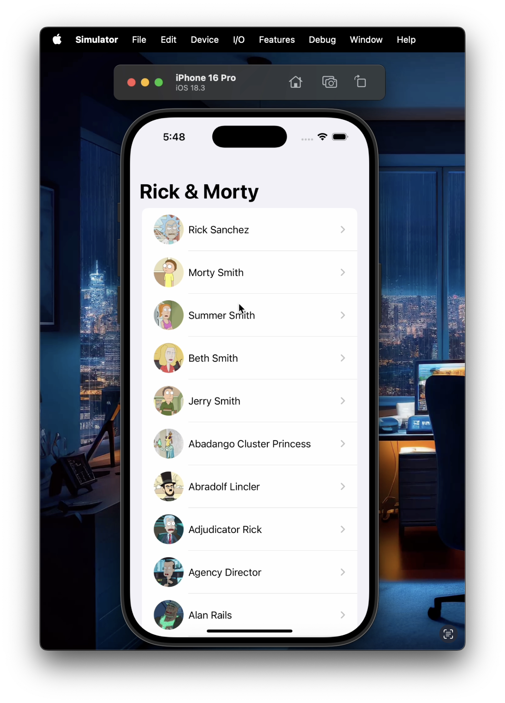
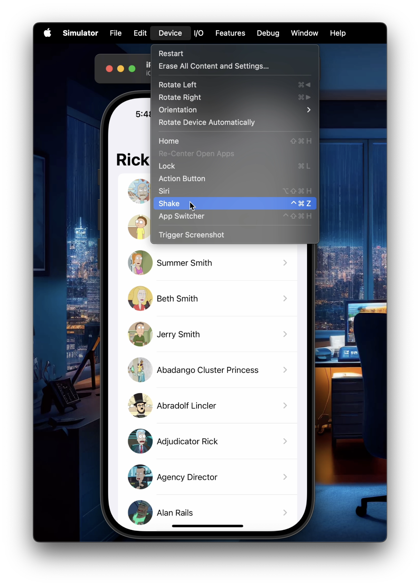
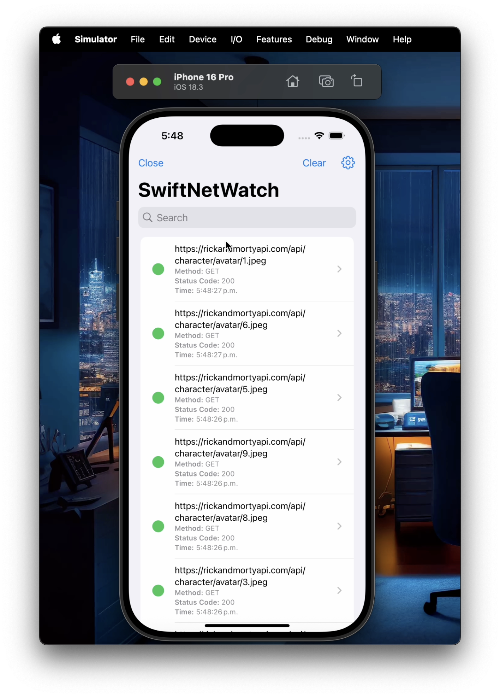
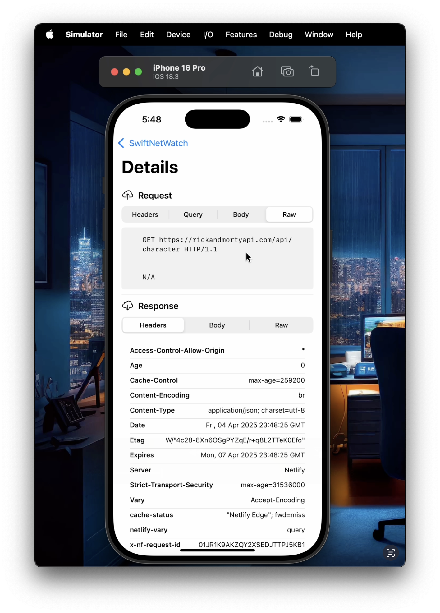

# SwiftNetWatch

> **An easy-to-use HTTP traffic inspector built with SwiftUI for iOS. Intercept, visualize, and debug network requests seamlessly.**

---

## 📦 Installation

### Swift Package Manager (Recommended)

1. Open your Xcode project.
2. Navigate to:
   ```
   File → Add Packages...
   ```
3. Paste the repository URL:
   ```
   https://github.com/knd8128/swift-net-watch.git
   ```
4. Select the desired version or branch, then click **"Add Package"**.

---

## 🚀 Quick Start

Integrate SwiftNetWatch into your app by starting the inspector in your AppDelegate:

```swift
import SwiftNetWatch

@main
class AppDelegate: UIResponder, UIApplicationDelegate {

    func application(
        _ application: UIApplication,
        didFinishLaunchingWithOptions launchOptions: [UIApplication.LaunchOptionsKey: Any]?
    ) -> Bool {
        #if DEBUG
        SwiftNetWatch.shared.start()
        #endif

        return true
    }
}
```

> 🔸 **Important:**  
> SwiftNetWatch will automatically intercept all network requests without additional setup.

---

## Screenshots






## 📱 How to Use

- Run your application normally.
- **Shake your device** to open the SwiftNetWatch overlay.
- If you're using the Simulator, simulate a shake gesture by navigating to:
  ```
  Simulator → Device → Shake
  ```
- Easily inspect all HTTP traffic including:
  - **Requests & Responses**
  - **Headers**
  - **Query parameters**
  - **Payloads (Body)**
  - **Raw HTTP Data**

> ⚠️ If request/query/body data is empty, the app will display `N/A` for clarity.

---

## ✅ Requirements

- **iOS 15.0+**
- **Swift 5.0+**

---

## 📄 License

SwiftNetWatch is available under the **MIT License**. See the [LICENSE](LICENSE) file for more details.

© 2024 knd8128. All rights reserved.
